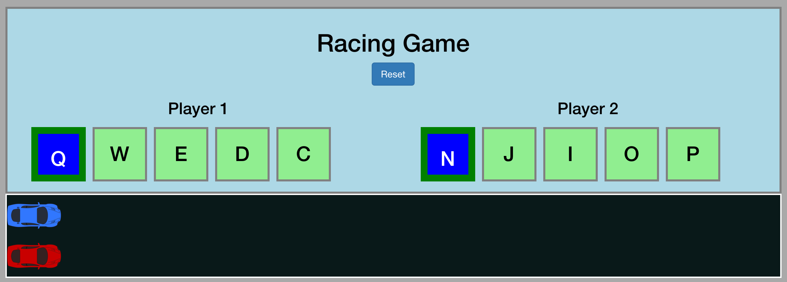

# Project 00: Racing Game
A Racing Game, where two or more players can move their "cars" across the browser to compete to make it to the finish line first.

<a href="http://ambassador-frog-25183.bitballoon.com/">Play Racing Game</a>

##Main Functionality
* Players must click the current highlighted key in their controls to accelerate their car.
* If they hit the incorrect key they will decelerate.
* The first player to reach the finish line wins.

## Technologies Used

* HTML
* CSS
* javascript
* jQuery
* Bootstrap

## Existing Features

* Two animated car sprites on a track.
* A unique set of controls for each player (5 keys each)
* Each player is assigned a target key which is highlighted until pressed.
* When a player successfully presses their current target key their speed increases, they move a distance of their updated speed, and a new target key is randomly assigned for that player and highlighted on the game.
* When a player hits an incorrect key from their controls (independently, or in combination with their target key), their current speed is reduced and they do not move.
* When a player's car reaches the end of the track, a popup alerts them of the winner.
* Reset button puts cars to beginning, and resets object values.

## Planned Features

* Custom player-set controls.
* Further punish button mashing (perhaps make the person make that many correct moves in order until they can move again).
* Improved imagery.

